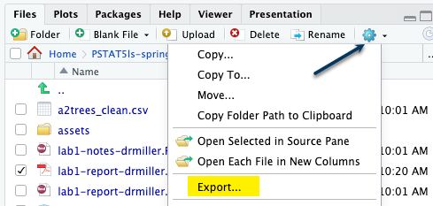
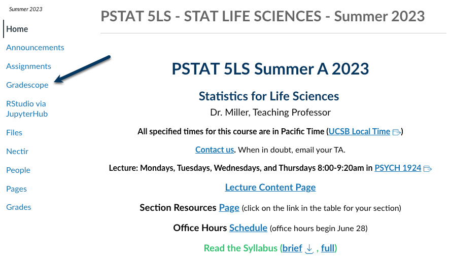

# Lab Notes

Use this place to take any notes during your lab section.

- Type any notes here
- Add new notes by using the dash `-` to create a list

# Lab Code

Use the chunks below to try out any code that you'd like. We have loaded the `penguins` data set for you in the first chunk, so you can try things out with this data.

```{r loadPenguins, error = T}
penguins <- read.csv("penguins.csv", stringsAsFactors = TRUE)
```

```{r tryIt1, error = T}
# Run this code chunk to create a scatterplot with bill_length_mm as the explanatory variable and body_mass_g as the response variable
plot(body_mass_g ~ bill_length_mm,
     data = penguins,
     main = "Scatterplot of Penguin Body Mass versus 
     Bill Length",
     xlab = "Bill Length (mm)",
     ylab = "Body Mass in (g)")

```

```{r tryIt2, error = T}
# Run this code chunk to compute the correlation between bill_length_mm and body_mass_g
cor(penguins$bill_length_mm, penguins$body_mass_g)

```

```{r tryIt3, error = T}
# Run this code chunk to subset the penguins data to contain only numeric variables. We will call this subset numericPenguins
numericPenguins <- subset(penguins,
                          select = c("bill_length_mm", "bill_depth_mm", 
                                     "flipper_length_mm", "body_mass_g")
                          )

```

```{r tryIt4, error = T}
# Run this code chunk to make a correlation matrix of numericPenguins
cor(numericPenguins)

```

```{r tryIt5, error = T}
# Run this code chunk to (1) create the linear regression model for body mass on flipper length, and assign it the name line1, then (2) summarize the linear regression model called line1
line1 <- lm(body_mass_g ~ flipper_length_mm, data = penguins)
summary(line1)

```

```{r tryIt6, error = T}
# Run this code chunk to create a scatterplot of body mass on flipper length, including the regression line
plot(penguins$body_mass_g ~ penguins$flipper_length_mm,
     main = "Scatterplot of Penguin Body Mass versus 
     Flipper Length",
     xlab = "Flipepr Length (mm)",
     ylab = "Body Mass in (g)")
abline(line1, col = "blue")

```

# Code Cheat Sheet

## `~`
- Read as "by"
- Used in side-by-side boxplots, scatterplots, and finding linear models
- `y ~ x` is the correct syntax for linear; `numeric_variable ~` categorical_variable` is the correct syntax for side-by-side boxplots

## `plot(y ~ x, data = data_name)`
- Used to create a scatterplot of the *y* variable by the *x* variable
- Can use the argument `data = data_name` to eliminate the need to specify where each of the variables *x* and *y* are contained

## `cor(x, y)`
- Finds the correlation coefficient between the numeric variable *x* and the numeric variable *y*

## `cor(numeric_data_frame)`
- Prints a correlation matrix for a data frame with all numeric variables

## `lm(y ~ x, data = data_name)`
- Finds the linear model between *x* and *y* from `data_name`
- You'll want to assign this a name in order to use it later

## `summary(linear_model_name)`
- Prints relevant values of a linear model

## `abline(linear_model_name)`
- Will plot the line found in `linear_model_name`

## Important plotting arguments

### `main = "Title of Your Graph in Double Quotes"`
- graph title that must be inside a set of double quotes

### `xlab = "x-axis Label of Your Graph in Double Quotes"`
- the x- (horizontal) axis label that must be inside a set of double quotes

### `ylab = "y-axis Label of Your Graph in Double Quotes"`
- the y- (vertical) axis label that must be inside a set of double quotes

# Reminder about Submission to Gradescope

At the top of the document, make sure you've changed the `author` field to your name (in quotes!) and the `date` field to today's date. 

When you've finished the lab, click the **Knit** button one last time.<br />


Give yourself a high five - you just wrote code! 

### Submission instructions
<!-- This is a comment and will not show up in your document. Note that the
numbering here is all 1's. This will automatically be converted to 1, 2, etc.
when you knit the document; writing all 1's makes it so you don't have to
constantly update the numbering when you move things around in editing! -->

1. In the Files pane, check the box next to your `lab1report.pdf`: </br>
  
  

2. Click More > Export... </br>

   </br>

3. Click Download and save the file on your computer in a folder you'll remember and be able to find later. You can just call the file `lab1-report.pdf` or whatever else you'd like (as  long as you remember what you called it). 

</br>


## Submission to Gradescope

- Access Gradescope through Canvas



## Submit to Gradescope Continued

- Click on the assignment name (e.g., Lab 1 Report). 
- Click Submit PDF > Select PDF > locate the file > Upload PDF. You can only submit one PDF file per assignment. 
- On your screen, you should see a list of the questions/problems in your assignment and thumbnails of your PDF page(s). For each question, click the question on the left and the PDF page(s) that contains the answers on the right.
- Now, click Submit. When your submission is successful, you will be sent to a new page to view your submission, you’ll see a success message on your screen, and you’ll receive an email. If your submitted file looks good, you see the success message, and you get the confirmation email, you’re done!
- If you need to, select the Resubmit button in the bottom right corner of your screen below your submission. Then, repeat the steps above as many times as needed before the assignment due date passes. We will only see your most recent submission when we grade your lab report. All your past submissions are in your Submission History.
